🏗️ A-Arch Build
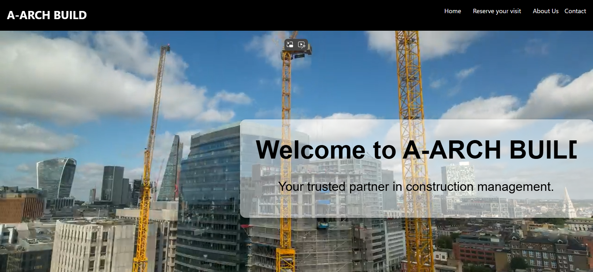 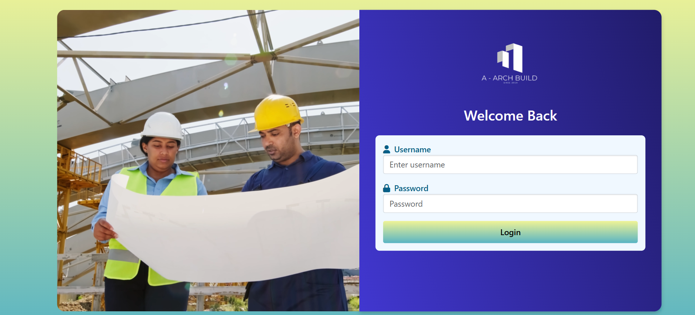

A-Arch Build is a comprehensive web application built using the MERN stack by a group of 7 members, including me, for our second-year project. It offers a range of features designed to streamline and manage various aspects of construction projects.

## 🚀 Features

### 📁 Project Management
Manage projects efficiently with tools to create, track, and update project details.
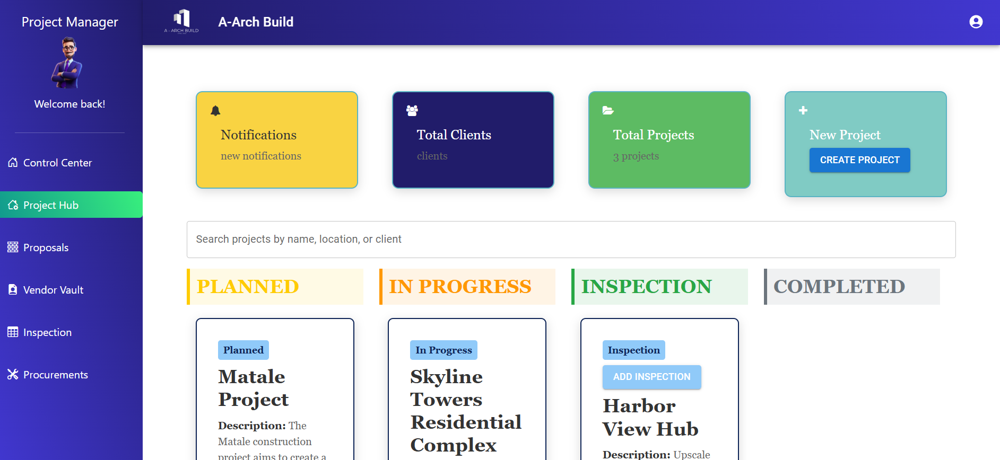

### 👤 Client Management
Easily manage client information, including profiles, project assignments, and communications.
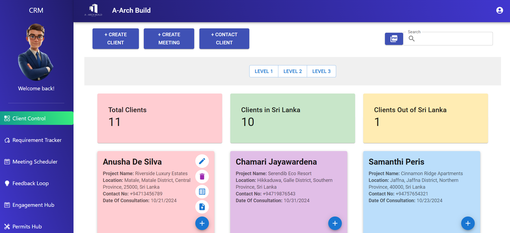

### 🏛️ Architect Dashboard
Upload and manage important architectural reports and permits in a dedicated dashboard.
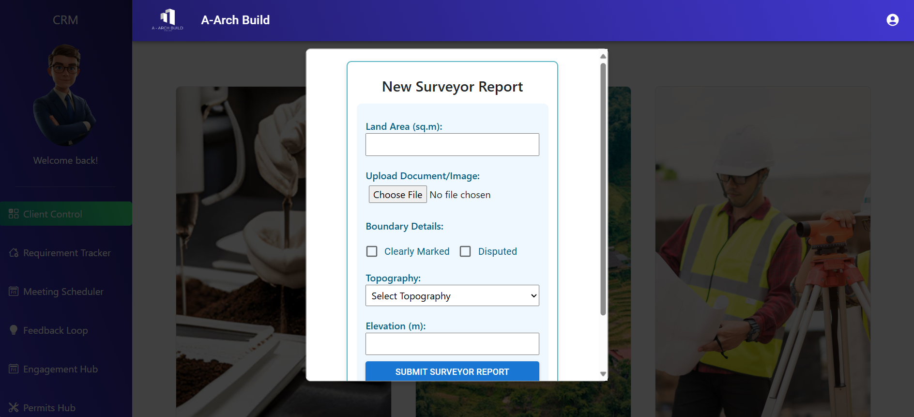

### 📝 Inspection Booking & Recording
Schedule and record construction inspections seamlessly.
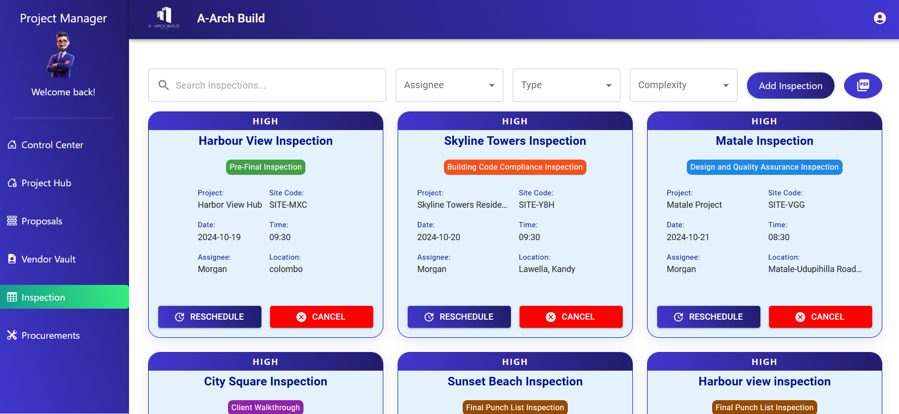
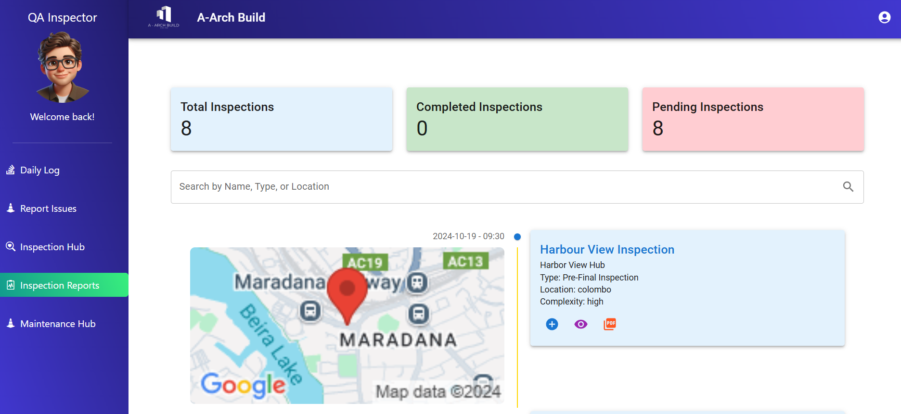

### 🗓️ Appointment Booking
Allow clients and team members to book appointments, ensuring streamlined project planning.
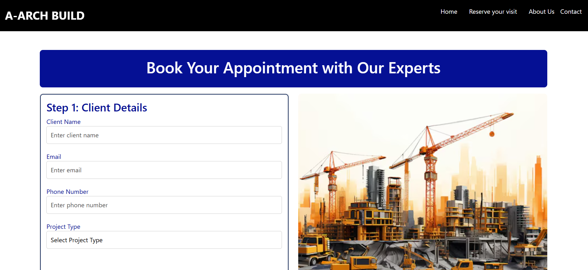

### 🛠️ Procurement & Proposal Creation
Simplify procurement processes and proposal creation to manage vendor relationships and project resources.
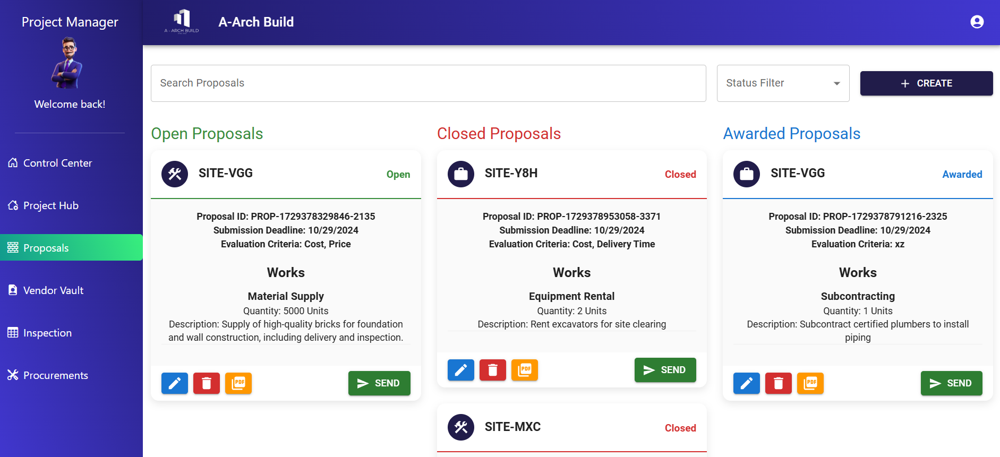
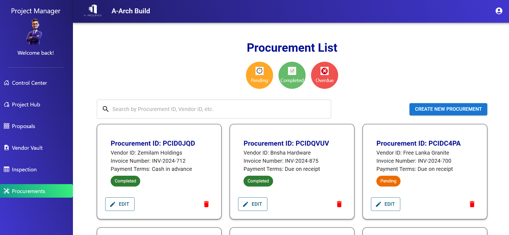

### 📅 Daily Logs & Issue Management
Track daily progress with logs and stay on top of daily issues for quick resolution.
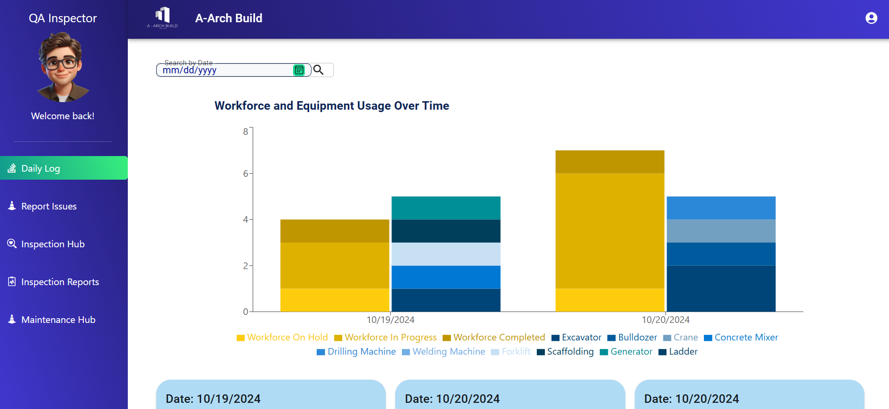
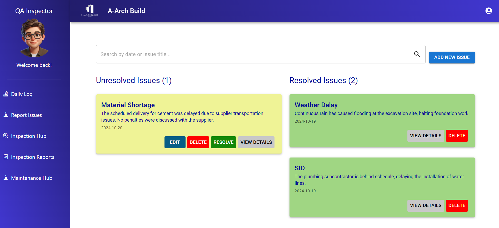

### 🏗️ Vendor Profile Management
Manage vendor profiles to track qualifications, assignments, and performance.
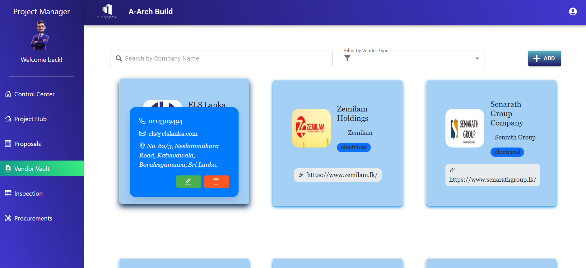

### 📋 Task Management
Assign and track tasks to ensure all construction activities are on schedule.
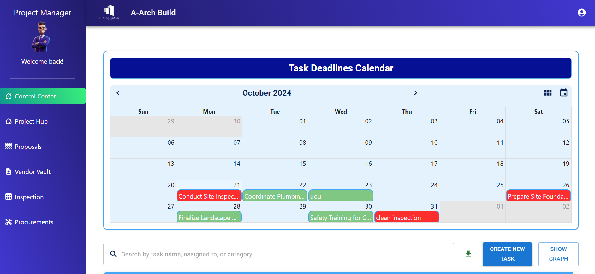

### 📑 Client Requirement Management
Efficiently handle client requirements with structured forms and feedback tracking.
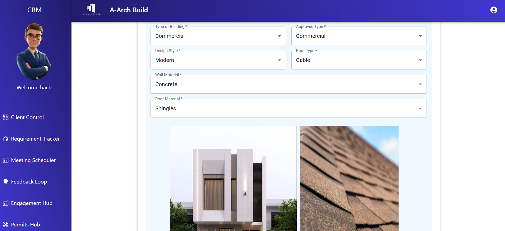

### 📁 Permit Management
Manage permits efficiently with tools to create, track, and update permit details.
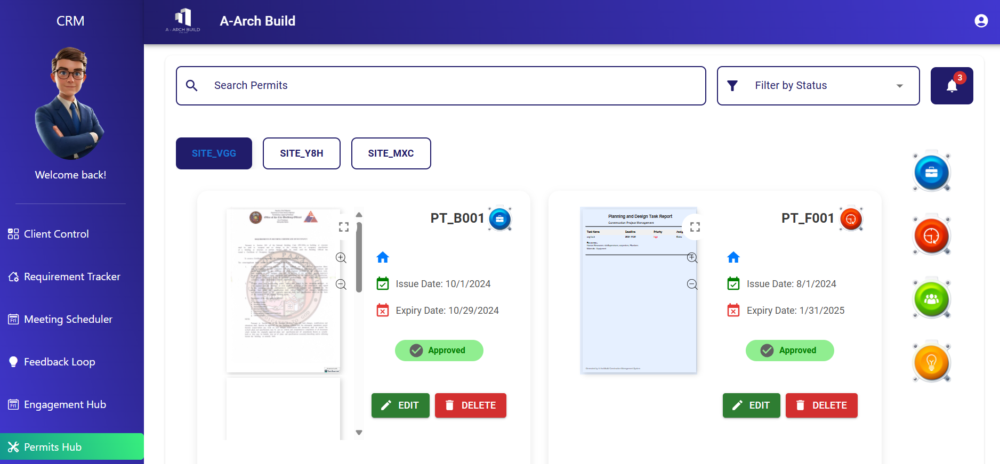

## 🛠️ Tech Stack

- **MongoDB**: Database for storing all project and client data.
- **Express.js**: Backend framework for handling API requests.
- **React.js**: Frontend framework for building the user interface.
- **Node.js**: Runtime environment for the backend.
